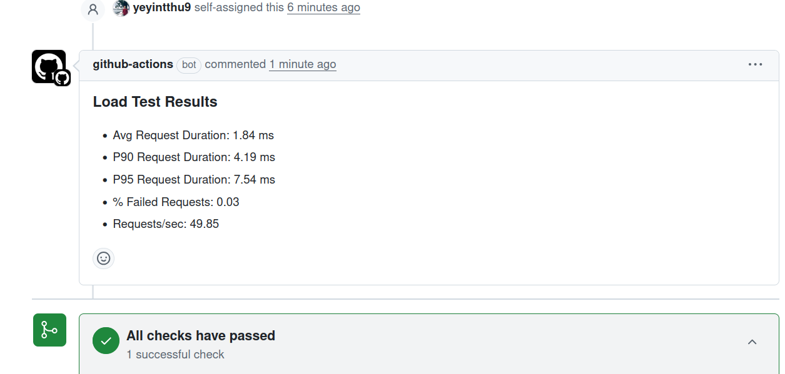

# http-echo • CI/CD + Kubernetes (Kind) Demo

This repository contains a tiny Go web server **http-echo** and a complete PR-based CI/CD flow using **GitHub Actions**, **Kind** (Kubernetes in Docker), **ingress-nginx**, and **k6** for load testing.

## What you get

- Go app that echoes text (`/app/http-echo`).
- Docker image (distroless) built from a statically linked binary.
- K8s manifests for two sample apps: `foo` and `bar`, each running http-echo.
- Ingress with hosts **foo.localhost** and **bar.localhost**.
- GitHub Actions workflow that:
  - Creates a **Kind** cluster
  - Builds the app and a Docker image
  - Loads the image into Kind
  - Deploys Deployments + Services + Ingress
  - Installs **ingress-nginx** so Ingress works on `localhost`
  - Runs **k6** load tests and posts results to the PR
---

## Prerequisites (for local runs)

- Docker (with buildx)
- Go 1.21+ (for building locally)
- kubectl
- Kind
- Helm
- k6
- jq

On GitHub Actions these are installed automatically by the workflow.

---

## Project structure

```
devOps-basic/
├─ .github/workflows/load-test-ci.yml # Main PR CI/CD workflow
├─ app/http-echo/                     # Go app
├─ k8s/
│  ├─ deployments.yaml                # Two Deployments: foo, bar (image placeholder)
│  ├─ services.yaml                   # Services for foo and bar (added)
│  └─ ingress.yaml                    # Ingress for foo.localhost / bar.localhost
├─ loadtest/k6-script.js              # Basic k6 load test
├─ scripts/wait-for-ingress.sh        # Waits for ingress to be reachable
└─ k8s/kind-config.yaml               # Kind cluster config (port mappings added)
```

---

## How the workflow works

The workflow **runs on Pull Requests to `main`** when changes touch `app/**`, `k8s/**`, `scripts/**`, `loadtest/**`, or `.github/workflows/**`.

High level steps:

1. **Checkout** repo.
2. **Install tools:** kind, kubectl, helm, k6, jq (and Go).
3. **Create Kind cluster** with extra port mappings (80/443) so ingress is reachable at `localhost`.
4. **Install ingress-nginx** using the official Kind manifest and wait for readiness.
5. **Build http-echo binary to `dist/linux/amd64/http-echo`** via `make -C app/http-echo OS=linux ARCH=amd64 bin`.
6. **Build Docker image** with build args and tag `http-echo:pr-<PR_NUMBER>`.
7. **Load image into Kind.**
8. **Deploy**:
   - Replace `IMAGE_PLACEHOLDER` in `k8s/deployments.yaml` with `http-echo:pr-<PR_NUMBER>` and apply
   - Apply `k8s/services.yaml`
   - Apply `k8s/ingress.yaml`
9. **Wait for ingress** (`foo.localhost` and `bar.localhost`) to become reachable.
10. **Run k6 load test**, compute metrics (avg, p90, p95, req/s), and **post a PR comment**.
11. **(Optional)** Install Prometheus stack.
12. **Cleanup** Kind cluster.

---

## Run end-to-end locally (optional)

```bash
# 1) Create cluster
kind create cluster --config k8s/kind-config.yaml

# 2) Install ingress-nginx (Kind)
kubectl apply -f https://raw.githubusercontent.com/kubernetes/ingress-nginx/main/deploy/static/provider/kind/deploy.yaml
kubectl wait --namespace ingress-nginx   --for=condition=Ready pods   --selector=app.kubernetes.io/component=controller   --timeout=180s

# 3) Build app binary to dist/
make -C app/http-echo OS=linux ARCH=amd64 bin

# 4) Build Docker image
PRODUCT_VERSION=$(cat app/http-echo/version/VERSION)
docker build --platform linux/amd64   --build-arg BIN_NAME=http-echo   --build-arg PRODUCT_VERSION=${PRODUCT_VERSION}   -t http-echo:dev app/http-echo

# 5) Load into Kind and deploy
kind load docker-image http-echo:dev --name kind
sed "s|IMAGE_PLACEHOLDER|http-echo:dev|g" k8s/deployments.yaml | kubectl apply -f -
kubectl apply -f k8s/services.yaml
kubectl apply -f k8s/ingress.yaml

# 6) Test
bash scripts/wait-for-ingress.sh foo.localhost 120
bash scripts/wait-for-ingress.sh bar.localhost 120
curl -s http://foo.localhost/
curl -s http://bar.localhost/
```

---

## Common pitfalls

- Make sure Docker Desktop (or daemon) is running; Kind needs it.
- If port 80/443 on your host are in use, change `k8s/kind-config.yaml` to map to different `hostPort`s and update the README commands accordingly.
---

## Sample PR Comment Output


## License

http-echo is © HashiCorp, MPL-2.0.
